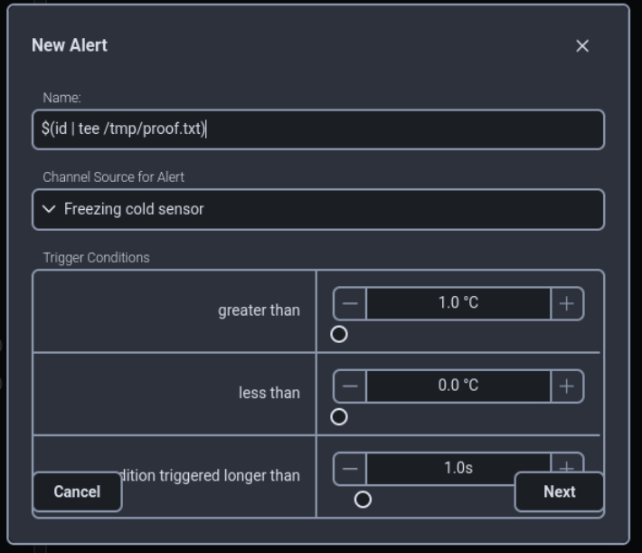
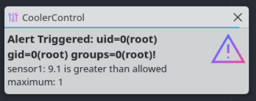

## Description

In **CoolerControl**, the user can define alerts that are triggered when a certain condition is met, e.g. the CPU overheating. The function to create a notification about the alert is vulnerable to command injection, allowing attackers to run arbitrary code on the system. The `coolercontrold` process always runs as `root`, leading to a complete system takeover. It can be used as a typical privilege escalation vector, or part of a longer exploit chain, see "Full exploit chain".

## Severity

High

## CVSS

[CVSS:3.1/AV:L/AC:L/PR:H/UI:N/S:C/C:H/I:H/A:H](https://www.first.org/cvss/calculator/3.1#CVSS:3.1/AV:L/AC:L/PR:H/UI:N/S:C/C:H/I:H/A:H)

## Steps to reproduce

Assumes a default `coolercontrold` installation with at least a single temperature source.

1.  Log in to the **CoolerControl** web UI at the following URL:
    
    ```
    http://localhost:11987/
    ```
    
2.  Navigate to **Alerts -> Add Alert**
    
3.  Select any valid temperature source as the **Channel Source for Alert**
    
4.  Select any valid **Trigger Conditions** so that the alert fires
    
5.  Insert the following shell payload as the Name:
    
    ```shell
    $(id | tee /tmp/proof.txt)
    ```
    
6.  Press **Next -> Apply Setting**  
    
    
7.  The alert triggers immediately. If desktop notifications are working, the command execution can be seen:  
    
    
8.  Further proof can be found in the file `/tmp/proof.txt`:
    
    ```shell
    user@computer~$ ls -lpah /tmp/proof.txt 
    -rw-r--r-- 1 root root 39 Jan 28 21:26 /tmp/proof.txt
    user@computer~$ cat /tmp/proof.txt 
    uid=0(root) gid=0(root) groups=0(root)
    
    ```
    

## Code reference

The vulnerability can be seen in the function `send_notifications` in [`alerts.rs`](https://gitlab.com/coolercontrol/coolercontrol/-/blob/560a0e068d1a4c746c28e2f24fadf4603f905e49/coolercontrold/src/alerts.rs).

Particularly in lines [576-579](https://gitlab.com/coolercontrol/coolercontrol/-/blob/560a0e068d1a4c746c28e2f24fadf4603f905e49/coolercontrold/src/alerts.rs#L576), where the following call is made, directly incorporating user input to the shell command:

```rust
Self::fire_command(&format!(
    "sudo -u \\#{} {} notify \"Alert Triggered: {}!\" \"{}\" 1 {}",
    uid, self.bin_path, alert.name, message, alert.desktop_notify_audio
));

```

The `fire_command` function is calling the `ShellCommand::new().run()` function from [`utils.rs`](https://gitlab.com/coolercontrol/coolercontrol/-/blob/560a0e068d1a4c746c28e2f24fadf4603f905e49/coolercontrold/src/repositories/utils.rs), which seems to ultimately call the runtime `tokio::process::Command`.

## External references

https://cwe.mitre.org/data/definitions/77.html

https://cwe.mitre.org/data/definitions/78.html

https://owasp.org/www-community/attacks/Command_Injection

## Suggested remediation steps

- User input escaping/sanitization

&nbsp;
