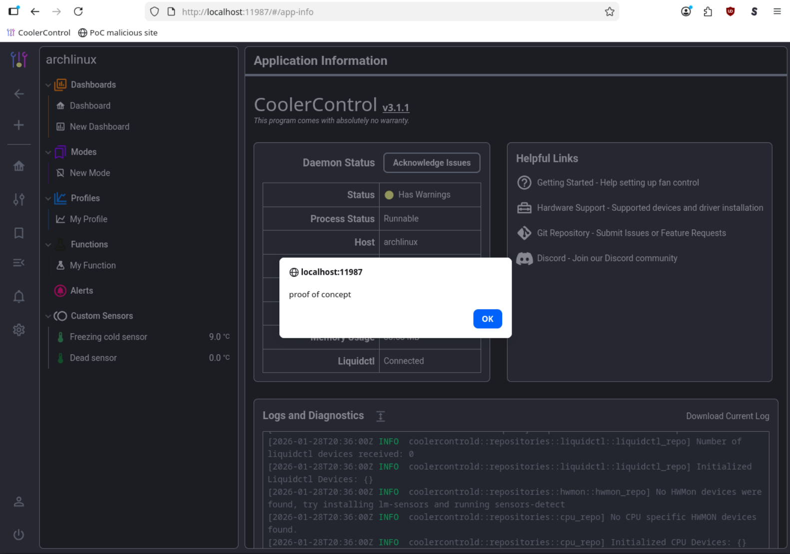

## Description

In **CoolerControl** web UI, the user can view logs from the `coolercontrold` service. The functionality does not properly escape HTML characters from the logs, making it vulnerable to Cross-Site Scripting (XSS). Furthermore, the log can be "poisoned" from multiple endpoints without authentication. Attackers can e.g. host a malicious website that inserts an XSS payload to the log by making a cross-origin request to the localhost service, and redirect users to the web UI to run the malicious JavaScript code. XSS allows attackers to do any actions in the service that the user has rights to, e.g. fan control, daemon restart, and alert creation. The vulnerability can be used as part of a longer exploit chain, see the "Full exploit chain".

## Severity

High

## CVSS

[CVSS:3.1/AV:N/AC:L/PR:N/UI:R/S:U/C:L/I:H/A:L](https://www.first.org/cvss/calculator/3.1#CVSS:3.1/AV:N/AC:L/PR:N/UI:R/S:U/C:L/I:H/A:L)

## Steps to reproduce

Assumes a default `coolercontrold` installation.

Assumes Firefox or Chrome is used as a browser. Currently [Brave seems to be the only browser almost completely protecting against localhost abuse by default](https://brave.com/privacy-updates/27-localhost-permission/). However, Brave does allows redirection to localhost (e.g. via `window.location.replace`), which means the attacker would need the target user to visit a malicious website twice, or do some other tricks (out of scope for this proof-of-concept).

[Chrome does have some protection](https://developer.chrome.com/blog/local-network-access), but [WebSockets can be used](https://developer.chrome.com/blog/local-network-access#known_issues_and_limitations) to make the request and insert the payload to the logs.

Testing of Local Network Access protections in your browser can be done e.g. [here](https://lna-testing.notyetsecure.com/).

1.  Create a file `poc.html` with the following contents:
    
    ```html
    <!DOCTYPE html>
    <html>
    <script>
    const payload = '';
    new WebSocket("ws://localhost:11987/custom-sensors/" + encodeURI(payload));
    window.location.replace("http://localhost:11987/#/app-info");
    </script>
    </html>
    
    ```
    
2.  Either host the file somewhere or open it directly in your browser.
    
3.  You're redirected to the web UI where the XSS fires:  
    
    

## Code reference

https://gitlab.com/coolercontrol/coolercontrol/-/blob/560a0e068d1a4c746c28e2f24fadf4603f905e49/coolercontrol-ui/src/views/AppInfoView.vue#L350

## External references

https://owasp.org/www-community/attacks/xss/

https://book.hacktricks.wiki/en/network-services-pentesting/pentesting-web/vuejs.html#v-html-directive

https://brave.com/privacy-updates/27-localhost-permission/

https://developer.chrome.com/blog/local-network-access

https://support.mozilla.org/en-US/kb/control-personal-device-local-network-permissions-firefox

https://lna-testing.notyetsecure.com/

## Suggested remediation steps

- User input escaping/sanitization
